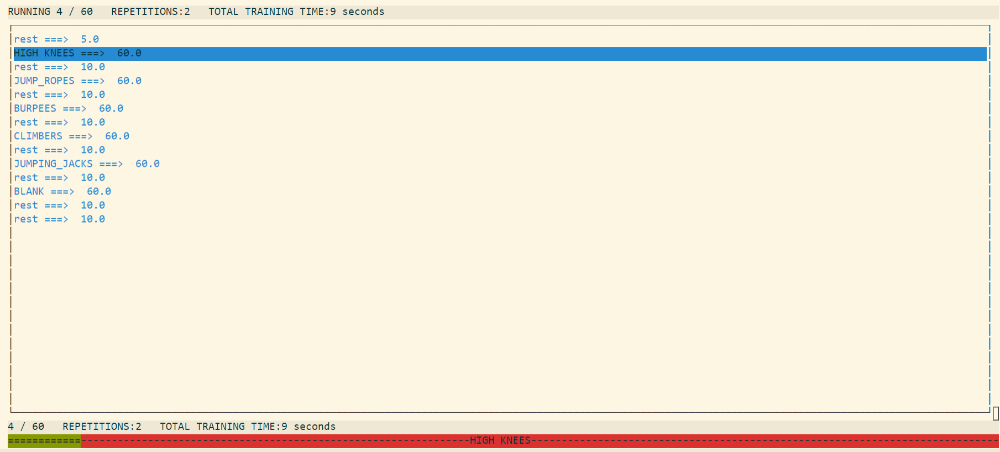

# trainingThing
A small cli HIIT (high intensity interval training) tool, that helps you getting :muscle: shredded :muscle: after these corona times :)





Example workout script:
```
# THIS TRAINING as base with changes: https://www.youtube.com/watch?v=t3rkNX2qd_k

trainmusic train.ogg
restmusic rest.ogg
donemusic done.ogg
nextroundmusic nextround.ogg

repetitions 2

# rest first to get you ready for training :)
rest 5

train 60 HIGH KNEES
rest 10

train 60 JUMP_ROPES
rest 10

train 60 BURPEES
rest 10

train 60 CLIMBERS
rest 10

train 60 JUMPING_JACKS
rest 10

train 60 BLANK
rest 10

## NOW MORE
rest 10


```

Usage
=====

```
training path/to/training/file
```

```
space => pause/resume workout
esc => exit
```
